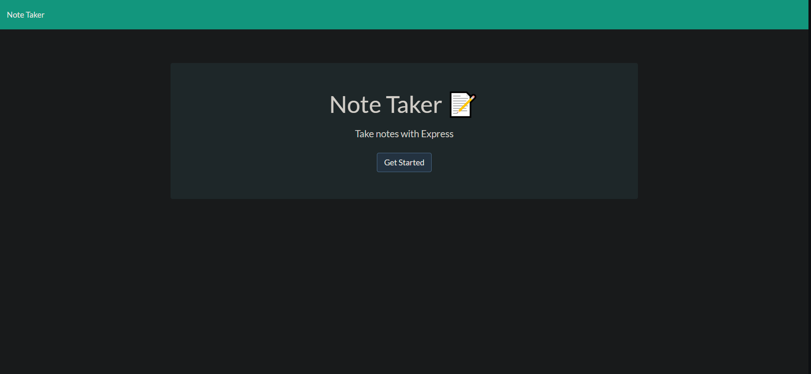
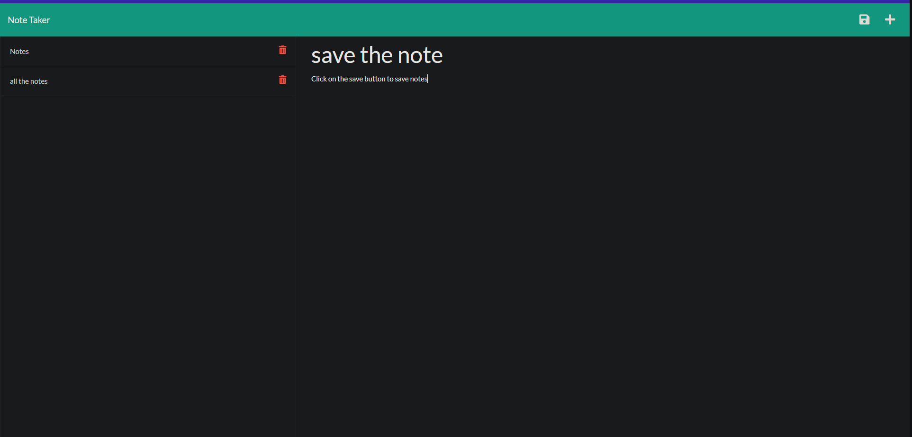

# Note Taker

## Description

the application displays notes you have written on a server then saves the notes to view for later.

## Table of Contents

- [Installation](#installation)
- [Contributing](#contributing)
- [Tests](#test)
- [Links](#links)
- [Questions](#questions)
- [License](#license)
- [Authors](#authors)

## Installation

nothing to install

## Contributing

anyone can contribute to this project just open an issue first

## Tests

there is no testing on this project

## Links
- deployed link https://floating-sands-82311.herokuapp.com

## Questions

If you have any questions feel free to either email me the question:

- My email: chebert222@gmail.com

## License

## Author

Cody Hebert

